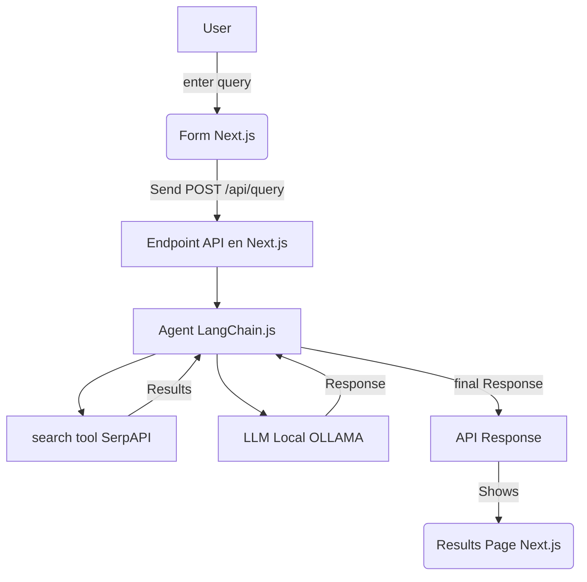
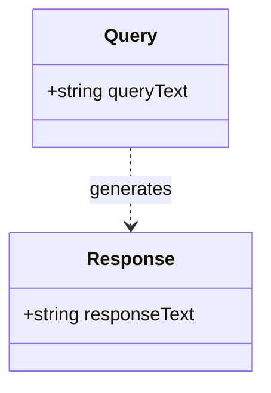

# Full Stack Developer Challenge - Next.js & LangChain.js

## Table of Contents

- [Overview](#overview)

- [Features](#features)

- [Installation and Setup](#installation-and-setup)

- [Project Structure](#project-structure)

- [API Documentation](#api-documentation)

- [System Diagram](#system-diagram)

- [Data Model](#data-model)

- [High-Level Questions](#high-level-questions)

- [Challenges and Solutions](#challenges-and-solutions)

- [Sources](#sources)

## Overview

This project is a full-stack solution that integrates Next.js with LangChain.js to answer user queries. The application uses a LangChain agent that combines a web search tool (SerpAPI) and a local LLM via the Ollama extension, allowing real-time answers based on information extracted from the web.

## Features

- **Query Form:** A page where the user enters their query.

- **API Route in Next.js:** An endpoint that triggers a LangChain.js agent.

- **Uses a Web Search Tool:** (SerpAPI via @langchain/community).

- **Integrates a Local LLM:** Through the Ollama extension.

- **Results Page:** Displays the final response generated by the agent.

- **Modern Styling:** The interface uses Tailwind CSS for a responsive, modern design with a dark theme and green accents.

## Requirements

- **Node.js:** Version 14 or higher.

- **Next.js:** v15.2.3 (with Turbopack).

- **Tailwind CSS:** For styling.

- **LangChain.js:** Integrated via the `langchain` package and `@langchain/community`
  .
- **Ollama:** A local service to run the LLM (ensure Ollama is installed and running).

- **SerpAPI:** A valid account and API key (defined in the `SERPAPI_API_KEY` environment variable).

## Installation and Setup

1. **Clone the repository:**

   ```bash
   git clone https://github.com/JoacoPeralta99/Mavin-Challenge.git
   cd mavin-challenge
   ```

2. **Install dependencies:**

```bash
npm install
```

3 **Configure environment variables:**

Create a .env (or .env.local) file in the project root with the following content (replace the values as needed):

    SERPAPI_API_KEY=tu_clave_valida_de_serpapi
    OLLAMA_BASE_URL=http://localhost:11434

4 **Tailwind CSS Configuration**

The tailwind.config.js and postcss.config.js files have already been created in the project root. Ensure that tailwind.config.js includes the correct paths:

```
module.exports = {
content: [
"./pages/**/*.{js,jsx,ts,tsx}",
"./components/**/*.{js,jsx,ts,tsx}",
"./app/**/*.{js,jsx,ts,tsx}",
],
theme: {
extend: {},
},
plugins: [],
};
```

5. **Local Execution**
   Start the Next.js application:

```bash
npm run dev
```

The application will be available at http://localhost:3000.

**Start Ollama locally:**

Ensure Ollama is running and that the required model (e.g., llama3) is downloaded.

```bash
ollama run llama3
```

6. **Test the Application:**

- Enter a query in the application form.

- The API will process the query by invoking the LangChain agent.

- The final response will be displayed on the results page.

## Project Structure

We follow the App Router approach, which provides a declarative and modular structure where each route is defined by its own folder. This approach promotes clarity and scalability.

```
mavin-challenge/
├── .next/
├── .env
├── app/
│   ├── api/
│   │   └── query/
│   │       └── route.js
│   ├── results/
│   │   └── page.js
│   ├── favicon.ico
│   ├── globals.css
│   ├── layout.js
│   └── page.js
├── node_modules/
├── public/
├── .gitignore
├── jsconfig.json
├── package.json
├── package-lock.json
├── postcss.config.js
├── tailwind.config.js
├── README.md
└── tsconfig.json
```

- **app/api/query/**: Contains the endpoint (route.js) that processes the user query and orchestrates the LangChain agent (calls SerpAPI and uses Ollama).

- **app/page.js**: The main page displaying the query form for the user.

- **app/results/page.js**: The page where the final response from the agent is rendered.

- **app/layout.js**: Global layout that wraps all pages, importing global styles and setting the base structure (HTML and body).

- **styles/globals.css**: Global styles file (including Tailwind CSS) applied across the application.

- **public/**: Static files (images, icons, etc.) served to the client..

- **package.json y postcss.config.js / tailwind.config.js**: Configuration files for dependencies and styles, enabling Tailwind CSS and other tools.

## API Documentation

- **Description**:
  Processes the query submitted by the user by invoking a LangChain agent that uses a web search tool (SerpAPI) and a local LLM (Ollama) to generate the final answer.

- **Endpoint**: `/api/query` [POST]

- **Request**:

  - **Headers**:
  - `Content-Type: application/json`

- **Body Example**:

```json
{
  "query": "your query here"
}
```

- **Response**:

- **Body Example** (ejemplo):

```json
{
  "response": "The final answer generated by the agent"
}
```

## Web Search Tool

**SerpAPI:**
Used via the package @langchain/community/tools/serpapi. The API key is configured using the SERPAPI_API_KEY environment variable.

## Local LLM Integration

**Ollama:**
Uses the Ollama LangChain.js extension to run a local LLM. Ensure that Ollama is running on the configured port (e.g., http://localhost:11434) and that the required model (e.g., llama3) is available.

## System Diagram



## Data Model



## High-Level Questions

**¿How would you implement authentication?**

You could use JSON Web Tokens (JWT) to authenticate users and protect the API routes.

**¿How would you scale the system for thousands of requests per houra?**

I would utilize Docker containers and orchestration with Kubernetes to horizontally scale the application, implement load balancers, and use caching (e.g., with Redis) to reduce load on critical endpoints. I would also consider separating the LLM service and the search tool into independent microservices.

**¿How would you implement logging in the API?**

I would employ a logging library such as Winston or Morgan to log all incoming requests and responses, and integrate a centralized logging system (e.g., ELK Stack or cloud services like Datadog) for real-time monitoring.

**¿How would you test the API?**

I would write unit tests using Jest for individual logic, integration tests with Supertest to validate API endpoints, and end-to-end tests with Cypress to simulate the complete user flow.

## Challenges and Solutions

**Integration of Ollama on Windows:**

- Challenge: Ollama is native to macOS, which complicates running it on Windows.

- Solution: I evaluated alternative solutions compatible with Windows and documented the limitations.

**Configuration and Parsing of the Zero-Shot Agent:**

Challenge: The agent kept iterating and did not produce a “Final Answer”.

Solution: Initially, I adjusted the maxIterations and modified the prompt to force the agent to produce a final answer. Ultimately, I opted for a manual pipeline to ensure a final response.

## Sources

- **Next.js Documentation:** [Next.js Documentation](https://nextjs.org/docs)

- **LangChain.js Documentation:** [LangChain.js Documentation](https://js.langchain.com/docs/)

- **Ollama Documentation:** [Ollama Documentation](https://ollama.com/library/llama3)

- **SerpAPI Documentation:** [SerpAPI](https://serpapi.com/)

- **ChatGPT:** [ChatGPT Blog](https://openai.com/blog/chatgpt)

- **Tailwind CSS Documentation:** [Tailwind CSS Documentation](https://tailwindcss.com/docs)
