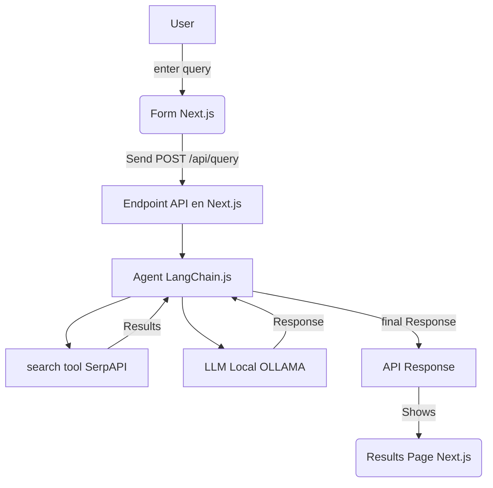
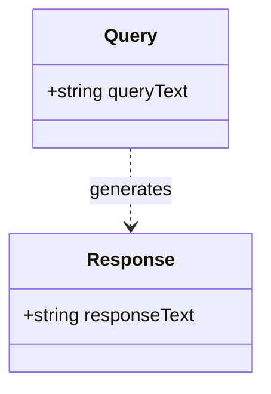

# Full Stack Developer Challenge - Next.js & LangChain.js

## Índice

- [Descripción General](#descripción-general)

- [Características](#características)

- [Instalación y Configuración](#instalación-y-configuración)

- [Estructura del Proyecto](#estructura-del-proyecto)

- [Documentación del API](#documentación-del-api)

- [Diagrama del Sistema](#diagrama-del-sistema)

- [Modelo de datos](#modelo-de-datos)

- [Preguntas de Alto Nivel](#preguntas-de-alto-nivel)

- [Desafíos y Soluciones](#desafíos-y-soluciones)

- [Fuentes](#fuentes)

## Descripción General

Este proyecto es una solución full-stack que integra Next.js con LangChain.js para responder consultas de usuarios. La aplicación utiliza un agente de LangChain que combina una herramienta de búsqueda web (SerpAPI) y un LLM local a través de la extensión Ollama, permitiendo obtener respuestas en tiempo real a partir de información extraída de la web.

## Características

- Formulario de Consulta: Página donde el usuario ingresa su consulta.

- Ruta API en Next.js: Endpoint que activa un agente de LangChain.js.

- Utiliza una herramienta de búsqueda web (SerpAPI a través de @langchain/community).

- Integra un LLM local mediante la extensión Ollama.

- Página de Resultados: Muestra la respuesta final generada por el agente.

- Estilos Modernos: La interfaz utiliza Tailwind CSS para un diseño responsivo y - moderno, con enfoque en un tema oscuro y detalles en verde.

- Requisitos
- Node.js: Versión 14 o superior.

- Next.js: v15.2.3 (con Turbopack).

- Tailwind CSS: Para estilos.

- LangChain.js: Integrado vía el paquete langchain y @langchain/community.

- Ollama: Servicio local para ejecutar el LLM (asegúrate de tener Ollama instalado y corriendo).

- SerpAPI: Cuenta y API key válida (definida en la variable de entorno SERPAPI_API_KEY).

## Instalación y Configuración

1. **Clona el repositorio:**

   ```bash
   git clone <URL_DE_TU_REPO>
   cd mavin-challenge
   ```

2. **Instala las dependencias:**

   ```bash
   npm install
   ```

3 **Configura las variables de entorno:**

Crea un archivo .env en la raíz del proyecto con el siguiente contenido (reemplaza los valores según corresponda):

    SERPAPI_API_KEY=tu_clave_valida_de_serpapi
    OLLAMA_BASE_URL=http://localhost:11434

4 **Configuración de Tailwind CSS:**

Ya se han creado los archivos tailwind.config.js y postcss.config.js en la raíz del proyecto. Revisa que tailwind.config.js incluya los paths correctos:

```
module.exports = {
content: [
"./pages/**/*.{js,jsx,ts,tsx}",
"./components/**/*.{js,jsx,ts,tsx}",
"./app/**/*.{js,jsx,ts,tsx}",
],
theme: {
extend: {},
},
plugins: [],
};
```

5. **Ejecución Local**
   Levanta la aplicación Next.js:

   ```bash
   npm run dev
   ```

La aplicación estará disponible en http://localhost:3000.

**Levanta Ollama localmente:**

Asegúrate de que Ollama esté corriendo y tenga descargado el modelo requerido (por ejemplo, llama3) puedes usar:

```bash
ollama run llama3
```

6. **Prueba la aplicación:**

Ingresa una consulta en el formulario.

La API procesará la consulta invocando al agente de LangChain.

La respuesta final se mostrará en la página de resultados.

## Estructura del Proyecto

Seguimos el enfoque de App Router que permite una estructura más declarativa y modular, donde cada ruta se define por su propia carpeta. Este enfoque promueve la claridad y la escalabilidad.

```
mavin-challenge/
├── .next/
├── .env
├── app/
│   ├── api/
│   │   └── query/
│   │       └── route.jsx
│   ├── results/
│   │   └── page.jsx
│   ├── favicon.ico
│   ├── globals.css
│   ├── layout.jsx
│   └── page.jsx
├── node_modules/
├── public/
├── .gitignore
├── jsconfig.json
├── package.json
├── package-lock.json
├── postcss.config.js
├── tailwind.config.js
├── README.md
└── tsconfig.json
```

- **app/api/query/**: Contiene el endpoint (route.jsx) que procesa la consulta del usuario y orquesta la lógica del agente de LangChain (llamada a SerpAPI y uso de Ollama).

- **app/page.jsx**: Página principal que muestra el formulario de consulta para que el usuario ingrese su pregunta.

- **app/results/page.jsx**: Página donde se renderiza la respuesta final generada por el agente.

- **app/layout.jsx**: Layout global que envuelve todas las páginas, importando estilos y configurando la estructura básica (por ejemplo, html y body).

- **styles/globals.css**: Archivo de estilos globales (incluyendo Tailwind CSS) que se aplica en toda la aplicación.

- **public/**: Archivos estáticos (imágenes, íconos, etc.) que se sirven al cliente.

- **package.json y postcss.config.js / tailwind.config.js**: Configuraciones de dependencias y estilos que permiten la integración de Tailwind CSS y otras herramientas.

## Documentación del API

- **Descripción**:

- **Endpoint**: `/api/query` [POST]

- **Esquema de Solicitud**:

  - **Headers**:
  - `Content-Type: application/json`

- **Body** (ejemplo):

```json
{
  "query": "tu consulta aquí"
}
```

- **Formato de Respuesta**:

- **Body** (ejemplo):

```json
{
  "response": "La respuesta final generada por el agente"
}
```

## Herramienta de Búsqueda Web

**SerpAPI:**
Se utiliza a través del paquete @langchain/community/tools/serpapi. La API key se configura mediante la variable SERPAPI_API_KEY.

## Integración del LLM Local

**Ollama:**
Se usa la extensión de Ollama de LangChain.js para ejecutar el LLM local. Asegúrate de que Ollama esté corriendo en el puerto configurado (por ejemplo, http://localhost:11434) y que el modelo (por ejemplo, llama3) esté disponible.

## Diagrama del Sistema



## Modelo de Datos



## Preguntas de Alto Nivel

**¿Cómo implementarías autenticación?**

se podria usar JSON Web Tokens (JWT) para autenticar a los usuarios y proteger las rutas API.

**¿Cómo escalarías el sistema para miles de requests por hora?**

Utilizaría contenedores Docker y orquestación con Kubernetes para escalar la aplicación.

Implementaría balanceadores de carga por ejemplo, Redis para reducir la carga en los endpoints críticos.

Consideraría separar el servicio LLM y la herramienta de búsqueda en microservicios independientes.

**¿Cómo implementarías logging en la API?**

Emplearía una librería como Winston o Morgan para registrar todas las peticiones y respuestas.

Integraría un sistema de logging centralizado (por ejemplo, servicios en la nube como AWS Datadog) para monitorear la aplicación.

**¿Cómo probarías la API?**

Escribiría tests unitarios con Jest para la lógica individual.

Tests de integración usando Supertest para verificar el comportamiento de los endpoints.

Tests end-to-end utilizando Cypress para simular el flujo completo del usuario.

## Desafíos y Soluciones

- Integración de Ollama en Windows:

- Desafío: Ollama es nativo de macOS, lo que complicó la ejecución en Windows.

- Solución: evalué las alternativas compatibles con Windows, y documenté las limitaciones.

- Configuración y parsing del agente Zero-Shot:

- Desafío: El agente seguía iterando y no entregaba un “Final Answer”.

- Solución: En principio ajusté maxIterations y modifiqué el prompt para forzar que el agente emita la respuesta final pero al final opte por implementar un pipeline manual como alternativa.

## Fuentes

- **Documentación oficial de Next.js:** [Next.js Documentation](https://nextjs.org/docs)
- **Documentación de LangChain.js:** [LangChain.js Documentation](https://js.langchain.com/docs/)
- **Documentación de Ollama:** [Ollama Documentation](https://ollama.com/library/llama3)
- **SerpAPI Documentation:** [SerpAPI](https://serpapi.com/)

- **ChatGPT:** [ChatGPT Blog](https://openai.com/blog/chatgpt)

- **Documentación de Tailwind CSS:** [Tailwind CSS Documentation](https://tailwindcss.com/docs)
